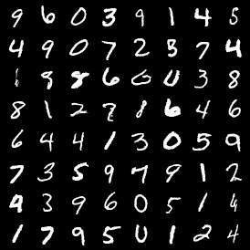

# PyTorch implementation of Progressive Growing of GANs
A PyTorch implementation of "Progressive Growing of GANs for Improved Quality, Stability and Variability" (https://arxiv.org/abs/1710.10196) compatible with **PyTorch 0.4**.

## Implementation details
- The growing of the GAN is based on a progress parameter p that increases during training. This parameter drives the sizes of input and output of the generator and the discriminator.
- The equalized learning rate is achieved by the WScaleLayer that mutliplies the input of the convolution by the normalization constant from He's initializer instead of modifying the convolution weights.
- The networks input and output resolutions depend on the maxRes parameter: the images will be square of resolution 4 * 2^(maxRes): maxRes=0 -> 4x4, maxRes=1 -> 8x8, ..., maxRes=8 -> 1024x1024

I tried to follow the original article as much as possible.
This repo gives a simple example of how it can be used on MNIST.

This implementation was done in **Python 3.6** and uses f-string so this will create errors in previous Python versions.

## Generated Images
This is an example obtained from training the PG-GAN on MNIST during 90 epochs (60 epochs of growing + 30 epochs of stabilizing) by running `python mnist_example.py --PN --WS --bias`

More results coming for CIFAR10.

## Acknowledgement
- https://github.com/tkarras/progressive_growing_of_gans/

## Author
Jerome Rony [@Latope2-150](https://github.com/Latope2-150)
